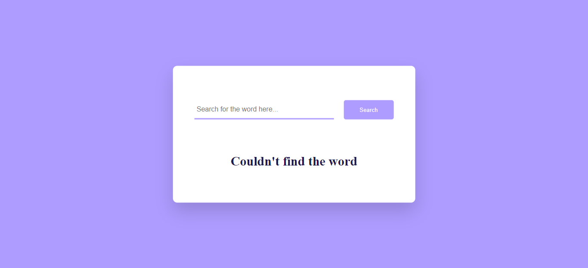
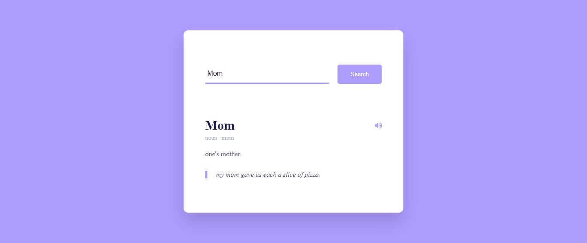

# Dictionary-API

This app is a dictionary that allows you to read the definition of a word, hear how it is pronounced and have an example of this word in a sentence. Through the API of [Free Dictionary API](https://dictionaryapi.dev/) I was able to carry out this project. The dictionary is only available in English.

## Display

## Tools used in this project:
- [Free Dictionary API](https://dictionaryapi.dev/)
- [Font-Awesome Library](https://cdnjs.com/libraries/font-awesome)
- [Google Fonts](https://fonts.google.com/)

